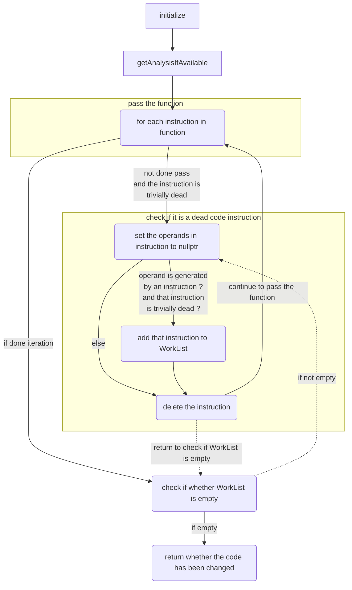
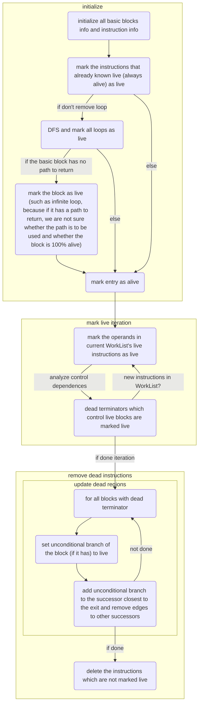

# LLVM &TVM 相关

[A Tour to LLVM IR（上）](https://zhuanlan.zhihu.com/p/66793637)

[LLVM Language Reference Manual](https://releases.llvm.org/2.7/docs/LangRef.html#i_br)

[lexical_analyzer 词法分析](https://github.com/Ewenwan/Compiler2019/tree/master/lab1_lexical_analyzer)

[syntax_analyzer 语法分析](https://github.com/Ewenwan/Compiler2019/tree/master/lab1_lexical_analyzer)

[LLVM  RISC - V ](https://github.com/Ewenwan/Compiler2019/tree/master/lab4)


##  下载LLVM 8.0.1源码并编译

* Step 1) 首先是一些必要依赖的安装
  ``` bash
  sudo apt-get install -y cmake xz-utils build-essential wget
  ```
* Step 2) 在仓库之外,选择好你的工作目录,下载源码,最后得到名为llvm的目录
  ``` bash
  # 下载
  wget https://github.com/llvm/llvm-project/releases/download/llvmorg-8.0.1/llvm-8.0.1.src.tar.xz
  wget https://github.com/llvm/llvm-project/releases/download/llvmorg-8.0.1/cfe-8.0.1.src.tar.xz
  # 解压缩
  tar xvf llvm-8.0.1.src.tar.xz
  mv llvm-8.0.1.src llvm
  tar xvf cfe-8.0.1.src.tar.xz
  mv cfe-8.0.1.src llvm/tools/clang
  ```
* Step 3) 编译并安装.这里在内存及硬盘充足的条件下,推荐`Debug`配置的编译,这更能让你体验"较大的项目"的编译过程.否则请采用`Release`配置的编译
  ``` bash
  mkdir llvm-build && cd llvm-build
  # Release
  cmake ../llvm -DCMAKE_BUILD_TYPE=Release -DCMAKE_INSTALL_PREFIX=`cd .. && pwd`/llvm-install
  # Debug
  cmake ../llvm -DCMAKE_BUILD_TYPE=Debug -DCMAKE_INSTALL_PREFIX=`cd .. && pwd`/llvm-install
  # 编译安装,下面的N表示的是你采取的同时执行的编译任务的数目.你需要将其替换为具体的数值,如8,4,1
  # 如果内存充足,一般推荐将N设置为cpu核数的2倍,如果未指明N,将会尽可能多地并行编译
  make -jN install
  # 这一过程可能有半小时至两小时不等,如果内存不足,可以尝试减小N并重新make,已经编译好的部分不会重新编译
  ```
* Step 4) 配置PATH,使得生成的二进制文件方便使用.配置PATH在以后的工作中也会是经常用到的,希望大家熟练掌握(或者至少熟练如何搜索)
  ``` bash
  # 将llvm-install/bin目录的完整路径,加入到环境变量PATH中
  # 假设该完整路径为the_path_to_your_llvm-install_bin,
  # 如果你的默认shell是zsh,可以在~/.zshrc中加入一行:
  export PATH=the_path_to_your_llvm-install_bin:$PATH
  # 然后执行
  source ~/.zshrc
  # 如果你的默认shell是bash,欢迎自行google/baidu

  # 最后,检查PATH配置是否成功,执行命令:
  llvm-config --version
  # 成功标志:
  8.0.1 #或类似
  # 失败标志:
  zsh: command not found: llvm-config #或类似
  ```
  
  
## 函数构建 赋值语句构建 assign_generator


```c
#include <llvm/IR/BasicBlock.h>
#include <llvm/IR/Constants.h>
#include <llvm/IR/DerivedTypes.h>
#include <llvm/IR/Function.h>
#include <llvm/IR/IRBuilder.h>
#include <llvm/IR/LLVMContext.h>
#include <llvm/IR/Module.h>
#include <llvm/IR/Type.h>
#include <llvm/IR/Verifier.h>

#include <iostream>
#include <memory>

#ifdef DEBUG  // 用于调试信息,大家可以在编译过程中通过" -DDEBUG"来开启这一选项
#define DEBUG_OUTPUT std::cout << __LINE__ << std::endl;  // 输出行号的简单示例
#else
#define DEBUG_OUTPUT
#endif

using namespace llvm;

#define CONST(num) ConstantInt::get(context, APInt(32, num))

int main()
{
    LLVMContext context;
    Type *TYPE32 = Type::getInt32Ty(context);
    IRBuilder<> builder(context);
    auto module = new Module("assign", context);

    auto mainFun = Function::Create(FunctionType::get(TYPE32, false), GlobalValue::ExternalLinkage, "main", module);

    auto bb = BasicBlock::Create(context, "entry", mainFun); //代码中只有 entry 一个 BasicBlock。
    // Begin: BasicBlock entry
    builder.SetInsertPoint(bb);

    auto a = builder.CreateAlloca(TYPE32);
    a->setAlignment(4);                                //Allocate a.
    builder.CreateStore(CONST(1), a)->setAlignment(4); // Store the value to a.

    auto retval = builder.CreateLoad(a);
    retval->setAlignment(4); // Load the value to retval.

    builder.CreateRet(retval); // Return.
    // End: BasicBlock entry
    module->print(outs(),nullptr);
    delete module;
    return 0;
}

// 对于的 llvm IR
/*
; ModuleID = 'assign.c'
source_filename = "assign.c"
target datalayout = "e-m:e-i64:64-f80:128-n8:16:32:64-S128"
target triple = "x86_64-unknown-linux-gnu"

define i32 @main() {
    %a = alloca i32, align 4        ; 在栈上给 a 分配内存
    store i32 1, i32* %a, align 4   ; 在 a 的地址里写入 1
    %retval = load i32, i32* %a, align 4 ; 从 a 的地址里读出返回值
    ret i32 %retval                 ; 返回
}
*/

```


## 函数调用语句构建
代码中共有两个BasicBlock，都叫做entry，但是存在于不同的函数中，对应关系见注释。

```c

#include <llvm/IR/BasicBlock.h>
#include <llvm/IR/Constants.h>
#include <llvm/IR/DerivedTypes.h>
#include <llvm/IR/Function.h>
#include <llvm/IR/IRBuilder.h>
#include <llvm/IR/LLVMContext.h>
#include <llvm/IR/Module.h>
#include <llvm/IR/Type.h>
#include <llvm/IR/Verifier.h>

#include <iostream>
#include <memory>

#ifdef DEBUG                                             // 用于调试信息,大家可以在编译过程中通过" -DDEBUG"来开启这一选项
#define DEBUG_OUTPUT std::cout << __LINE__ << std::endl; // 输出行号的简单示例
#else
#define DEBUG_OUTPUT
#endif

using namespace llvm;

#define CONST(num) ConstantInt::get(context, APInt(32, num))

int main()
{
    LLVMContext context;
    Type *TYPE32 = Type::getInt32Ty(context);
    IRBuilder<> builder(context);
    auto module = new Module("call", context);

    std::vector<Type *> Ints(1, TYPE32); // Declare type of function args.
    auto calleeFunction = Function::Create(FunctionType::get(TYPE32, Ints, false),
                                           GlobalValue::LinkageTypes::ExternalLinkage,
                                           "callee", module);

    auto entry = BasicBlock::Create(context, "entry", calleeFunction);
    // Begin: BasicBlock entry in calleeFunction.
    builder.SetInsertPoint(entry);

    // Get args.
    std::vector<Value *> args;
    for (auto arg = calleeFunction->arg_begin(); arg != calleeFunction->arg_end(); arg++)
    {
        args.push_back(arg);
    }

    auto mul = builder.CreateMul(CONST(2), args[0]);
    builder.CreateRet(mul); // End of calleeFunction.
    // End: BasicBlock entry in calleeFunction.

    auto mainFun = Function::Create(FunctionType::get(TYPE32, false), GlobalValue::LinkageTypes::ExternalLinkage, "main", module);
    entry = BasicBlock::Create(context, "entry", mainFun);
    // Begin: BasicBlock entry in mainFun.
    builder.SetInsertPoint(entry);

    auto call = builder.CreateCall(calleeFunction, {CONST(10)}); // Call the function.
    builder.CreateRet(call);
    // End: BasicBlock entry in mainFun.

    module->print(outs(), nullptr);
    delete module;
    return 0;
}

/*

; ModuleID = 'call.c'
source_filename = "call.c"
target datalayout = "e-m:e-i64:64-f80:128-n8:16:32:64-S128"
target triple = "x86_64-unknown-linux-gnu"

define i32 @callee(i32 %a) {    ; 声明 callee 函数.
    %mul = mul i32 2, %a
    ret i32 %mul                ; 返回 2 * a.
}

define i32 @main() {
    %retval = call i32 @callee(i32 10)  ; 调用函数.
    ret i32 %retval                     ; 返回.
}

*/


```


## GCD 生成


```c

  
#include <llvm/IR/BasicBlock.h>
#include <llvm/IR/Constants.h>
#include <llvm/IR/DerivedTypes.h>
#include <llvm/IR/Function.h>
#include <llvm/IR/IRBuilder.h>
#include <llvm/IR/LLVMContext.h>
#include <llvm/IR/Module.h>
#include <llvm/IR/Type.h>
#include <llvm/IR/Verifier.h>

#include <iostream>
#include <memory>

#ifdef DEBUG  // 用于调试信息,大家可以在编译过程中通过" -DDEBUG"来开启这一选项
#define DEBUG_OUTPUT std::cout << __LINE__ << std::endl;  // 输出行号的简单示例
#else
#define DEBUG_OUTPUT
#endif

using namespace llvm;  // 指明命名空间为llvm
#define CONST(num) \
  ConstantInt::get(context, APInt(32, num))  //得到常数值的表示,方便后面多次用到

int main() {
  LLVMContext context;
  Type *TYPE32 = Type::getInt32Ty(context);
  IRBuilder<> builder(context);
  auto module = new Module("gcd", context);  // module name是什么无关紧要

  // 函数参数类型的vector
  std::vector<Type *> Ints(2, TYPE32);
  auto gcdFun = Function::Create(FunctionType::get(TYPE32, Ints, false),
                                 GlobalValue::LinkageTypes::ExternalLinkage,
                                 "gcd", module);

  // BB的名字在生成中无所谓,但是可以方便阅读
  auto bb = BasicBlock::Create(context, "entry", gcdFun);
  builder.SetInsertPoint(bb);                     // 一个BB的开始
  auto retAlloca = builder.CreateAlloca(TYPE32);  // 返回值的空间分配
  auto uAlloca = builder.CreateAlloca(TYPE32);    // 参数u的空间分配
  auto vAlloca = builder.CreateAlloca(TYPE32);    // 参数v的空间分配

  std::vector<Value *> args;  //获取gcd函数的参数,通过iterator
  for (auto arg = gcdFun->arg_begin(); arg != gcdFun->arg_end(); arg++) {
    args.push_back(arg);
  }

  builder.CreateStore(args[0], uAlloca);  //将参数u store下来
  builder.CreateStore(args[1], vAlloca);  //将参数v store下来

  auto vLoad = builder.CreateLoad(vAlloca);           //将参数v load上来
  auto icmp = builder.CreateICmpEQ(vLoad, CONST(0));  // v和0的比较,注意ICMPEQ

  auto trueBB = BasicBlock::Create(context, "trueBB", gcdFun);    // true分支
  auto falseBB = BasicBlock::Create(context, "falseBB", gcdFun);  // false分支
  auto retBB = BasicBlock::Create(
      context, "", gcdFun);  // return分支,提前create,以便true分支可以br

  auto br = builder.CreateCondBr(icmp, trueBB, falseBB);  // 条件BR
  DEBUG_OUTPUT // 我调试的时候故意留下来的,以醒目地提醒你这个调试用的宏定义方法
  builder.SetInsertPoint(trueBB);  // if true; 分支的开始需要SetInsertPoint设置
  auto uLoad = builder.CreateLoad(uAlloca);
  builder.CreateStore(uLoad, retAlloca);
  builder.CreateBr(retBB);  // br retBB

  builder.SetInsertPoint(falseBB);  // if false
  uLoad = builder.CreateLoad(uAlloca);
  vLoad = builder.CreateLoad(vAlloca);
  auto div = builder.CreateSDiv(uLoad, vLoad);  // SDIV - div with S flag
  auto mul = builder.CreateNSWMul(div, vLoad);  // NSWMUL - mul with NSW flags
  auto sub = builder.CreateNSWSub(uLoad, mul);  // the same
  auto call = builder.CreateCall(gcdFun, {vLoad, sub});
  // {vLoad, sub} - 参数array
  builder.CreateStore(call, retAlloca);
  builder.CreateBr(retBB);  // br retBB

  builder.SetInsertPoint(retBB);  // ret分支
  auto retLoad = builder.CreateLoad(retAlloca);
  builder.CreateRet(retLoad);

  // main函数
  auto mainFun = Function::Create(FunctionType::get(TYPE32, false),
                                  GlobalValue::LinkageTypes::ExternalLinkage,
                                  "main", module);
  bb = BasicBlock::Create(context, "entry", mainFun);
  // BasicBlock的名字在生成中无所谓,但是可以方便阅读
  builder.SetInsertPoint(bb);

  auto xAlloca = builder.CreateAlloca(TYPE32);
  auto yAlloca = builder.CreateAlloca(TYPE32);
  auto tempAlloca = builder.CreateAlloca(TYPE32);

  builder.CreateStore(CONST(0), tempAlloca);
  builder.CreateStore(CONST(72), xAlloca);
  builder.CreateStore(CONST(18), yAlloca);

  auto xLoad = builder.CreateLoad(xAlloca);
  auto yLoad = builder.CreateLoad(yAlloca);
  icmp = builder.CreateICmpSLT(xLoad, yLoad);  // ICMPLT with S

  trueBB = BasicBlock::Create(context, "trueBB", mainFun);
  falseBB = BasicBlock::Create(context, "falseBB", mainFun);
  builder.CreateCondBr(icmp, trueBB, falseBB);

  builder.SetInsertPoint(trueBB);
  builder.CreateStore(xLoad, tempAlloca);
  builder.CreateStore(yLoad, xAlloca);
  auto tempLoad = builder.CreateLoad(tempAlloca);
  builder.CreateStore(tempLoad, yAlloca);
  builder.CreateBr(falseBB);  // 注意在下一个BB之前要Br一下

  builder.SetInsertPoint(falseBB);
  xLoad = builder.CreateLoad(xAlloca);
  yLoad = builder.CreateLoad(yAlloca);
  call = builder.CreateCall(gcdFun, {xLoad, yLoad});
  builder.CreateRet(call);
  builder.ClearInsertionPoint();
  // 给这么多注释了,但是可能你们还是会弄很多bug
  // 所以强烈建议配置AutoComplete,效率会大大提高!
  // 别人配了AutoComplete,只花1小时coding
  // 你没有配AutoComplete,找method花5小时,debug花5小时,肯定哭唧唧!
  // 最后,如果猜不到某个IR指令对应的C++的函数,建议把指令翻译成英语然后在method列表中搜索一下
  // 最后的最后,这个例子只涉及到了一点基本的指令生成,
  // 对于额外的指令,包括数组,在之后的实验中可能需要大家好好搜索一下思考一下,
  // 还有涉及到的C++语法,可以在gitlab上发issue提问或者向大家提供指导,会有bonus哦!
  // 对于这个例子里的代码风格/用法,如果有好的建议也欢迎提出!
  module->print(outs(), nullptr);
  delete module;
  return 0;
}


/*


*/
```

## IF 语句构建

 代码中共有 3 个 BasicBlock，分别是 entry, truebb, falsebb，对应关系在注释中给出。
 
```c
#include <llvm/IR/BasicBlock.h>
#include <llvm/IR/Constants.h>
#include <llvm/IR/DerivedTypes.h>
#include <llvm/IR/Function.h>
#include <llvm/IR/IRBuilder.h>
#include <llvm/IR/LLVMContext.h>
#include <llvm/IR/Module.h>
#include <llvm/IR/Type.h>
#include <llvm/IR/Verifier.h>

#include <iostream>
#include <memory>

#ifdef DEBUG                                             // 用于调试信息,大家可以在编译过程中通过" -DDEBUG"来开启这一选项
#define DEBUG_OUTPUT std::cout << __LINE__ << std::endl; // 输出行号的简单示例
#else
#define DEBUG_OUTPUT
#endif

using namespace llvm;

#define CONST(num) ConstantInt::get(context, APInt(32, num))

int main()
{
    LLVMContext context;
    Type *TYPE32 = Type::getInt32Ty(context);
    IRBuilder<> builder(context);
    auto module = new Module("if", context);

    auto mainFun = Function::Create(FunctionType::get(TYPE32, false), GlobalValue::ExternalLinkage, "main", module);

    auto bb = BasicBlock::Create(context, "entry", mainFun);
    // Begin: BasicBlock entry
    builder.SetInsertPoint(bb);

    auto truebb = BasicBlock::Create(context, "truebb", mainFun);
    auto falsebb = BasicBlock::Create(context, "falsebb", mainFun);

    auto icmp = builder.CreateICmpSGT(CONST(2), CONST(1)); // ? 2>1.

    auto br = builder.CreateCondBr(icmp, truebb, falsebb); // Create conditional branch.
    // End: BasicBlock entry

    // Begin: BasicBlock truebb
    builder.SetInsertPoint(truebb);
    builder.CreateRet(CONST(1)); // Return 1 in true branch.
    // End: BasicBlock truebb

    // Begin: BasicBlock falsebb
    builder.SetInsertPoint(falsebb);
    builder.CreateRet(CONST(0)); // Return 0 in false branch.
    // End: BasicBlock falsebb

    module->print(outs(), nullptr);
    delete module;
    return 0;
}

/*
; ModuleID = 'if.c'
source_filename = "if.c"
target datalayout = "e-m:e-i64:64-f80:128-n8:16:32:64-S128"
target triple = "x86_64-unknown-linux-gnu"

define i32 @main() {
entry:
    %cmp = icmp sgt i32 2, 1           ; 比较 2 是否大于 1，结果赋给 %cmp
    br i1 %cmp, label %if.then, label %if.end  ; 分支指令，如果 %cmp 为真，则跳转 %if.then 否则 %if.end

if.then:
    ret i32 1               ;返回
if.end:
    ret i32 0               ;返回

}
*/
```


## while 语句构建

代码中共有 4 个basicBlock，分别是entry, loop, truebb, ret，对应关系见注释。

```c
#include <llvm/IR/BasicBlock.h>
#include <llvm/IR/Constants.h>
#include <llvm/IR/DerivedTypes.h>
#include <llvm/IR/Function.h>
#include <llvm/IR/IRBuilder.h>
#include <llvm/IR/LLVMContext.h>
#include <llvm/IR/Module.h>
#include <llvm/IR/Type.h>
#include <llvm/IR/Verifier.h>

#include <iostream>
#include <memory>

#ifdef DEBUG                                             // 用于调试信息,大家可以在编译过程中通过" -DDEBUG"来开启这一选项
#define DEBUG_OUTPUT std::cout << __LINE__ << std::endl; // 输出行号的简单示例
#else
#define DEBUG_OUTPUT
#endif

using namespace llvm;

#define CONST(num) ConstantInt::get(context, APInt(32, num))

int main()
{
    LLVMContext context;
    Type *TYPE32 = Type::getInt32Ty(context);
    IRBuilder<> builder(context);
    auto module = new Module("while", context);

    auto mainFun = Function::Create(FunctionType::get(TYPE32, false), GlobalValue::ExternalLinkage, "main", module);

    auto bb = BasicBlock::Create(context, "entry", mainFun);
    builder.SetInsertPoint(bb);             // Entry.
    // Begin: BasicBlock entry
    auto a = builder.CreateAlloca(TYPE32);
    auto i = builder.CreateAlloca(TYPE32);

    builder.CreateStore(CONST(10), a);
    builder.CreateStore(CONST(0), i);

    auto loop = BasicBlock::Create(context, "loop", mainFun);
    auto truebb =BasicBlock::Create(context, "truebb", mainFun);
    auto ret = BasicBlock::Create(context, "ret", mainFun);
    builder.CreateBr(loop);                 // Jump to loop.
    // End: BasicBlock entry

    // BasicBlock: BasicBlock loop
    builder.SetInsertPoint(loop);

    auto iLoad = builder.CreateLoad(i);
    auto aLoad = builder.CreateLoad(a);
    auto icmp = builder.CreateICmpSLT(iLoad, CONST(10)); // See if should break.
    builder.CreateCondBr(icmp,truebb,ret);
    // End: BasicBlock loop

    // Begin: BasicBlock truebb
    builder.SetInsertPoint(truebb);
    auto inc = builder.CreateAdd(iLoad, CONST(1));
    auto tempa = builder.CreateAdd(inc, aLoad);
    builder.CreateStore(inc, i);
    builder.CreateStore(tempa, a); // i = i + 1; a = a + i;
    builder.CreateBr(loop);
    // End: BasicBlock truebb

    // Begin: BasicBlock ret
    builder.SetInsertPoint(ret);
    auto retval = builder.CreateLoad(a);
    builder.CreateRet(retval); // Return a
    // End: BasicBlock ret

    module->print(outs(), nullptr);
    delete module;
    return 0;
}

/*

; ModuleID = 'while.c'
source_filename = "while.c"
target datalayout = "e-m:e-i64:64-f80:128-n8:16:32:64-S128"
target triple = "x86_64-unknown-linux-gnu"

define i32 @main() {
entry:
    %a = alloca i32, align 4
    %i = alloca i32, align 4      ; 定义 a, i

    store i32 10, i32* %a, align 4
    store i32 0, i32* %i, align 4   ; 赋初值

    %0 = load i32, i32* %i, align 4

    %cmp = icmp slt i32 %0, 10     ; i<10 ?
    br i1 %cmp, label %loop, label %return
    
loop:
    %1 = load i32, i32* %i, align 4
    %2 = load i32, i32* %a, align 4
    %inc = add i32 %1, 1                
    store i32 %inc, i32* %i, align 4    ;i = i + 1
    %add = add i32 %inc, %2             
    store i32 %add, i32* %a, align 4    ; a = a + i

    %3 = icmp slt i32 %inc, 10          ; i<10?
    br i1 %3, label %loop, label %return

return:
    %retval = load i32, i32* %a, align 4;return a
    ret i32 %retval
}

*/

```
##
[c解析器实现 转换为 LLVM ir](https://github.com/Ewenwan/Compiler2019/tree/master/lab3-1)

## C++语法树的实现

### C++介绍

C++是一门面向对象的语言，从名字可以看出，C++从C中获得了许多灵感。但是随着C++的发展，它和C的差异也越来越大，一个典型的例子是C是弱类型的语言，而C++越来越支持强类型。因此我们不能直接认为C++兼容C，而应该先了解二者的区别。好在本次实验并不需要你们使用高级的C++特性，所以在此简单介绍一下部分特性便于理解。如果对C++有更深的兴趣，可以从Milo Yip的[游戏程序员的学习之路](https://github.com/miloyip/game-programmer/blob/master/game-programmer-zh-cn.jpg?raw=true)的C++部分开始看。

注：本介绍假设你有基本的C语言认知（略高于程设课标准），如果有不懂的C语言术语建议去搜索一下

#### class

class是C++面向对象的基础，它相当于对C中的结构体的扩展。除了保留了原来的结构体成员（即成员对象），它增加了成员函数、访问控制、继承和多态等。

假设某类为`Animal`，一个它的实例为`animal`，我们可以在`Animal`的定义中增加函数声明`void eat();`，这样声明的函数即是成员函数。成员函数的作用域中自带一个`Animal*`类型的指针`this`，指向调用该成员函数的实例。我们可以通过`animal.eat()`一样，用类似访问成员的方法访问该函数。

```cpp
// 注：C++中struct也会定义结构体，只是访问控制的默认选项有所区别
struct Animal {
  void eat()
}
```

类的访问控制指的是在定义class时，可以用`public`与`private`标签，指定接下来的成员是私有或是公开成员。公开成员可以在外部函数使用该类的实例时访问，而内部成员只有该类的成员函数能访问。访问控制的作用是对使用者隐藏实现的细节，而关注于设计者想要公开的接口，从而让使用者能更容易理解如何使用该类。详细介绍在[access specifiers](https://en.cppreference.com/w/cpp/language/access)。

类的继承是一种面向对象语言常用的代码复用方法，也是一种非常直观的抽象方式。我们可以定义`struct Cat : Animal`来声明`Cat`类是`Animal`类的子类，也就是`Cat`继承了`Animal`类。此时，新的`Cat`类从`Animal`类中继承了`void eat();`成员函数，并且可以在此之上定义额外的成员函数`void nyan()`。同理，我们也可以定义`struct Dog : Animal`来定义`Dog`类。
```cpp
struct Cat : Animal {
  // 从Animal中继承了void eat();
  void nyan()
};

struct Dog : Animal {
  // 从Animal中继承了void eat();
  void wang()
};
```
我们可以通过合理的继承结构来将函数定义在合适的位置，使得大部分通用函数可以共享。

同学们可能会想到同是`Animal`，`Cat`和`Dog`可能会有相同名称与参数的函数，但是却有着不同的实现，这时我们就要用到虚函数了。子类中可以定义虚函数的实现，从而使得不同子类对于同一个名字的成员函数有不同实现。虚函数在调用时会通过虚函数表查找到对应的函数实现，而不是和普通类一样查找对应类型的函数实现。
```cpp
struct Animal {
  // = 0 表示该虚函数在Animal类中没有实现
  virtual void say() = 0;
};

struct Cat : Animal {
  // override表示覆盖父函数中的实现，下同
  void say() override {
    std::cout << "I'm a cat" << std::endl;
  }
};

struct Dog : Animal {
  void say() override{
    std::cout << "I'm a dog" << std::endl;
  }
};

// 试一试
int main() {
  Cat c;
  Dog d;
  Animal* a;
  c.say();
  d.say();
  a = &c;
  a->say();
  a = &d;
  a->say();
  return 0;
}
```

#### 函数

C++中的函数可以重载，即可以有同名函数，但是要求它们的形参必须不同。如果想进一步了解，可以阅读[详细规则](https://en.cppreference.com/w/cpp/language/overload_resolution)。下面是函数重载的示例：

```cpp
struct Point {
  int x;
  int y;
};

struct Line {
  Point first;
  Point second;
};

void print(Point p) {
  printf("(%d, %d)", p.x, p.y);
}

void print(Line s) {
  print(s.first) // s.first == Point { ... }
  printf("->");
  print(s.second) // s.second == Point { ... }
}
```
我们可以看到上面的示例定义了两个`print`函数，并且它们的参数列表的类型不同。它们实际上是两个不同的函数（并且拥有不同的内部名字），但是C++能够正确的识别函数调用时使用了哪一个定义（前提是你正确使用了这一特性），并且在编译时就会链接上正确的实现。我们可以看到，这种特性非常符合人的直觉，并且没有带来额外开销。

#### 泛型

不同于C中使用void指针来实现泛型函数（如`qsort`），C++中使用模板来帮助定义泛型类型与泛型函数等。由于模板过于复杂，这里不做深入介绍。这里你们需要理解的是，C++中的模板定义正如其名，在实例化前只是一个模板而不是参与编译的代码。只有在你使用的过程中指定了参数，编译器才会自动根据模板产生相应的代码，也就是实例化该参数对应的代码。比如`std::vector`是C++中常用的数组容器，在使用时必须指定参数，如果要实例化`int`类型的数组容器，必须要使用`std::vector<int>`。

#### 内存分配

C中，只能使用标准库中的`malloc`与`free`来进行内存分配，并且需要手动在内存上初始化类型。C++中增加了`new`与`delete`关键字，你可以使用`new classname(params)`的完成申请一块内存，利用构造函数（`classname(params)`即代表调用`classname`类型的一个构造函数）来完成内存初始化。而`delete variable`可以调用变量对应类型函数的析构函数来完成数据结构的清理和回收内存。但是它存在着和C一样的二次回收导致报错或忘记回收导致内存泄漏的问题。于是C++11引入了许多智能指针类型，本实验中用到的有两种，分别是：

1. `std::shared_ptr`: 引用计数智能指针，使用一个共享变量来记录指针管理的对象被引用了几次。当对象引用计数为0时，说明当前该对象不再有引用，并且进程也无法再通过其它方式来引用它，也就意味着可以回收内存，这相当于低级的垃圾回收策略。
2. `std::unique_ptr`: 表示所有权的智能指针，该指针要求它所管理的对象智能有一次引用，主要用于语义上不允许共享的对象（比如`llvm::Module`）。当引用计数为0时，它也会回收内存。

#### 总结

经过这些介绍，相信你们已经成功入门了C++，并且足以解决实验中遇到的问题了。

### 访问者模式

访问者模式用于表示一个作用于某对象结构的各元素的操作。它使你可以在不改变各元素的类的前提下定义作用于这些元素的新操作，并且可以集中相关的操作而分离无关操作。实现时，在数据基础类里面有一个方法接受访问者，将自身引用传入访问者。这里举一个应用实例来帮助理解访问者模式：你在朋友家做客，你是访问者，而朋友接受你的访问，你通过朋友的描述，然后对朋友的描述做出一个判断，这就是访问者模式。

实验框架的`include/syntax_tree.hpp`与`src/syntax_tree_cpp/syntax_tree.cpp`中定义了语法树的转换，并且还有使用访问者模式定义的`syntax_tree_printer`来打印转换后的函数（该类被我来用作调试），你们可以参考其实现。

### 语法树设计

不同于C中每个非终结符与终结符对应同一种结点，在实验框架中的C++语法树中，大部分符号拥有了属于自己的类型。为此，我对原语法树做了一些修改，即将语法的第18条改为：
$`\text{expression} \rightarrow \text{assign-expression}\ |\ \text{simple-expression}`$，并新增加一条：
$`\text{assign-expression} \rightarrow \text{var}\ \textbf{=}\ \text{expression}`$。这种改动并没有影响语言的语义，但是有利于我们构建类型。

在语法树的实现中，我利用了C++继承较为灵活的特性，定义了各个符号，并且将语法树中的子节点定义为了成员变量便于你们访问。

### 辅助类Scope

在`include/cminus_builder.hpp`中，我还定义了一个用于存储作用域的类`Scope`。它的作用是辅助我们在遍历语法树时，管理不同作用域中的变量。它提供了以下接口：
```cpp
// 进入一个新的作用域
void enter();
// 退出一个作用域
void exit();
// 往当前作用域插入新的名字->值映射
bool push(std::string name, llvm::Value *val);
// 根据名字，寻找到值
llvm::Value* find(std::string name);
// 判断当前是否在全局作用域内
bool in_global();
```
你们需要根据语义合理调用`enter`与`exit`，并且在变量声明和使用时正确调用`push`与`find`。
在类`CminusBuilder`中，有一个`Scope`类型的成员变量`scope`，它在初始化时已经将`input`、`output`等函数加入了作用域中。因此，你们在进行名字查找时不需要顾虑是否需要对特殊函数进行特殊操作。

使用示例（仅作使用参考，实际使用要考虑遍历过程）：
```cpp
// 如果遇到compound-stmt需要进入新的作用域
scope.enter();

...

// 在作用域中加入变量
std::string name = "foo";
llvm::Value *val = builder.createAlloca(TYPE32);
scope.push(name, val);

...

// 寻找变量
std::string name = "foo";
llvm::Value *val = scope.find(name);

...

// 当前作用域结束，退出
scope.exit();
```

## pass 优化

dce       位于lib/Transforms/Scalar/DCE.cpp            该Pass会进行死代码删除

constprop 位于 lib/Transforms/Scalar/ConstantProp.cpp  该Pass会执行简单的常量传播。

adce      位于lib/Transforms/Scalar/ADCE.cpp           该Pass使用了更加激进的方式删除死代码

tailcallelim 位于lib/Transforms/Scalar/TailRecursionElimination.cpp  该Pass优化了尾递归 注：运行该Pass前应当先运行SROA

生成  未优化的 llvm IR： clang -S -emit-llvm test.c

opt优化器进行优化:       opt test.ll -<opt-name1> -<opt-name2> ... -S

## DCE

DCE 属于 Function Pass，能够比较保守地删除函数中的死代码。

可以删除的死代码类型为：如果某个量被声明但后续没有被使用，且初始化赋值该量时没有其他的潜在作用，则删除这个量的声明指令。

DCE 对设计的 LLVM IR 的优化

对于以下待优化代码：

```llvm
define i32 @some_func(){
  ret i32 1
}

; DCE 执行基本的死代码删除：
; LLVM IR 是 SSA 的，
; 因此 IR 中一个量有且只有一次赋值 (量被定义时即完成赋值)，
; 因此 IR 中一个量如果未被使用，即代表是死代码，
; DCE 即执行对这些死代码的删除，
; 以上准则有一个例外
; 如果初始化一个量的指令有潜在的额外作用
; 则此赋值不能被删除
define i32 @test_dce(){
  %used_alloca.ptr = alloca i32
  %unused_alloca.ptr = alloca i32               ; DCE 中会被删除
  %unused_tmp = load i32, i32* %used_alloca.ptr ; DCE 中会被删除
  %tmp_wont_delete = call i32 @some_func()     ; 调用函数可能会造成额外作用，因此这句不能能删除
  store i32 0, i32* %used_alloca.ptr
  %ret_val = load i32, i32* %used_alloca.ptr
  ret i32 %ret_val
}
```

执行 opt -dce -S dce.ll, 输出的代码如下：
```llvm
define i32 @some_func() {
  ret i32 1
}

define i32 @test_dce() {
  %used_alloca.ptr = alloca i32
  %tmp_wont_delete = call i32 @some_func()
  store i32 0, i32* %used_alloca.ptr
  %ret_val = load i32, i32* %used_alloca.ptr
  ret i32 %ret_val
}
```

可以看出原始代码中的 `(1)` `(2)` 两句，由于声明的 `unused_alloca.ptr` 和 `unused_tmp` 都未再被使用，因而被 DCE 过程删除。

而 `(3)` 中由于初始化 `tmp_wont_delete` 使用了一个函数调用的返回值，有潜在的额外影响，因此不能删除。

###  DCE 的流程

1. 初始化；
2. 对于函数中的每个 `trivially dead` 的指令 `a`：
   1. 对于这条指令中的每个操作数 `x`, 找到产生这个操作数的指令 `b`；
   2. 在 `a` 中把 `x` 置空；
   3. 如果此时 `b` 是 `trivially dead` 的，则把 `b` 加入 `worklist` 中；
   4. 删除指令 `a`;
3. 检查 `worklist` 是否为空，如果不为空，对于其中的每个指令，执行 `2.1` ~ `2.4`, 然后跳转到 `3`;
4. 结束。




## ADCE

ADCE 属于 Function Pass，激进地删除函数中的死代码。

删除的死代码的类型有：

- DCE 中的所有被删除的类型；
- 如果对于某个条件分支，无论执行流程通过哪个分支，得到的执行结果都一样，则把此条件分支改为**跳转到其两个后继 basic block 中 “距函数返回点更近” 的后继 basic block** 的无条件分支。此优化能用执行代价更小的无条件跳转替换有条件跳转。
  
  **“更近”** 被定义为：以**流图**中没有后继的 basic block 为根节点（一般含有 `ret` 语句），在**反向流图**（逆转所有边）中进行**后序 DFS** 所给出的 basic block 访问顺序（用一个数字描述），**数字越大，代表距离返回点 “更近”**。

###  ADCE 对设计的 LLVM IR 的优化

**ADCE 包括 DCE 的全部优化，此处不再赘述，仅指出 ADCE 相对 DCE 增加的优化部分。**

对于以下待优化代码：

```llvm
; ADCE 除了 DCE 中的基本优化，还加了对控制流程的优化
; 即如果一个有条件跳转，跳转到无论它的哪个后继，都不会对结果造成影响
; 那么这个跳转指令就可以改成无条件跳转
; ADCE 的具体实现中，会把它改为跳转到 “离返回点最近的” Basic Block

; 这个函数不会被优化
define i32 @test_adce_origin(i32 %a){
  %result.ptr = alloca i32
  %cmp = icmp slt i32 %a, 0  ; if a<0
  br i1 %cmp, label %if_true, label %if_false  ; 因为走不同的分支会对最后的 return 值造成影响，因此 ADCE 不会把这句改成 无条件跳转
if_true:
  store i32 -1, i32* %result.ptr
  br label %return
if_false:
  store i32 1, i32* %result.ptr
  br label %return
return:
  %result = load i32, i32* %result.ptr
  ret i32 %result
}

; 这个函数会被优化
define i32 @test_adce(i32 %a){
  %result.ptr = alloca i32
  %cmp = icmp slt i32 %a, 0  ; if a<0
  br i1 %cmp, label %if_true, label %if_false  ; 此时无论走哪个分支对结果都无影响，ADCE 会把这句改为无条件跳转
if_true:
  ; store i32 -1, i32* %result.ptr     ; 删除两个分支中对 result 的修改
  br label %return
if_false:
  ; store i32 1, i32* %result.ptr
  br label %return
return:
  %result = load i32, i32* %result.ptr
  ret i32 %result
}

```

执行 `opt -adce -S adce.ll`, 结果如下：

```llvm
define i32 @test_adce_origin(i32 %a) {
  %result.ptr = alloca i32
  %cmp = icmp slt i32 %a, 0
  br i1 %cmp, label %if_true, label %if_false	  ; (1)

if_true:                                          ; preds = %0
  store i32 -1, i32* %result.ptr				  ; (2)
  br label %return

if_false:                                         ; preds = %0
  store i32 1, i32* %result.ptr					  ; (3)
  br label %return

return:                                           ; preds = %if_false, %if_true
  %result = load i32, i32* %result.ptr
  ret i32 %result
}

define i32 @test_adce(i32 %a) {
  %result.ptr = alloca i32
  br label %if_true								  ; (4)

if_true:                                          ; preds = %0
  br label %return

if_false:                                         ; No predecessors!
  br label %return

return:                                           ; preds = %if_false, %if_true
  %result = load i32, i32* %result.ptr
  ret i32 %result
}
```

可以看出，在 `test_adce_origin` 函数中，if 语句走不同的分支，`result` 会有不同的值（`(2)` `(3)` 语句），因此在分析流程中，`(1)` 语句被标识为 `Live`, 因而 ADCE 不会对 `(1)` 这句条件跳转进行优化，`test_adce_origin` 函数保持原形态。

而在 `test_adce` 函数中，删除了 `(2)` `(3)` 语句，程序走 if 语句后的不同分支，对 `result` 的值不会造成影响，因此在分析流程中，`(1)` 语句被替换成了代价更小的无条件跳转，跳转目标是从原条件分支的两个目标中选出的 "距函数返回点更近" 的后继，即语句 `(4)`.


###  ADCE 的流程

1. 初始化；
2. 把所有的 `always alive` 的指令标注成 `lived`.
3. 如果不需要优化流程，则跳转到 6.
4. 如果不需要更改循环的流程，则通过 DFS 把所有的回边置为 `lived`。
5. 把 entry 设为 `lived`, 并把所有有 `lived` 指令的 basic block 设为 `lived`.
6. 迭代:
   1. 如果某非 `lived` 跳转指令的后继 basic block 中有 `lived`, 则把这条指令设置为 `lived`.
   2. 同时把产生这条指令的操作数的指令设置为 `lived`.
   3. 把新加入的 `lived` 指令所在的 basic block 设为 `lived`.
   4. 直到没有新的 `lived` 指令产生。
7. 对于某个 basic block 中的跳转指令，如果其本身不是 `lived`，则把其变为跳转到距离返回点 “更近的” 后继的无条件跳转指令，并将其变为 `lived`.
8. 删除没有标注为 `lived` 的指令。




## LLVM 8.0.1 适配 RISC-V
```SH

# 下载
$ wget https://github.com/llvm/llvm-project/releases/download/llvmorg-8.0.1/llvm-8.0.1.src.tar.xz
$ wget https://github.com/llvm/llvm-project/releases/download/llvmorg-8.0.1/cfe-8.0.1.src.tar.xz

# 解压缩
$ tar xvf llvm-8.0.1.src.tar.xz
$ mv llvm-8.0.1.src llvm
$ tar xvf cfe-8.0.1.src.tar.xz
$ mv cfe-8.0.1.src llvm/tools/clang

$ mkdir build
$ cd build

# 编译, 安装目录选择 /opt/llvm-8.0.1-release
$ cmake ../llvm-8.0.1.src -DCMAKE_BUILD_TYPE=Release -DCMAKE_INSTALL_PREFIX=/opt/llvm-8.0.1-release -DLLVM_EXPERIMENTAL_TARGETS_TO_BUILD=RISCV -DLLVM_TARGETS_TO_BUILD=X86
$ sudo make install -j64

# 配置环境变量
$ echo 'export LLVM=/opt/llvm-8.0.1-release' >> ~/.zshrc
$ echo 'export PATH=$PATH:$LLVM/bin' >> ~/.zshrc
$ source ~/.zshrc

# 此时配置了 RISCV 后端的 LLVM 即可用
$ clang --target=riscv64 -v
clang version 8.0.1 (tags/RELEASE_801/final)
Target: riscv64
Thread model: posix
InstalledDir: /opt/llvm-8.0.1-release/bin

# cmake 的几个参数：

-DCMAKE_BUILD_TYPE=Release: 在编译过程中加入 CMAKE_BUILD_TYPE=Release 这个宏，编译 Release 版本的二进制文件.
-DCMAKE_INSTALL_PREFIX=/opt/llvm-8.0.1-release: 指定安装目录为 /opt/llvm-8.0.1-release.
-DLLVM_EXPERIMENTAL_TARGETS_TO_BUILD=RISCV: 开启实验性的 RISCV 后端支持.
-DLLVM_TARGETS_TO_BUILD=X86: 开启 x86 后端支持.

```
### 1.2 lab3-0 GCD 样例 LLVM IR 生成 RISC-V 源码的过程

1. **首先需要编译 riscv-gnu-toolchain**.

   ```bash
   # 这个 clone 很慢，所以实际上采用了别的手段加速，首先 git clone 到境外 VPS, 然后 scp 到编译服务器上, 完成编译后再 scp 到本地
   $ git clone --recursive https://github.com/riscv/riscv-gnu-toolchain

   # 安装依赖
   $ sudo apt install autoconf automake autotools-dev curl libmpc-dev libmpfr-dev libgmp-dev gawk build-essential bison flex texinfo gperf libtool patchutils bc zlib1g-dev libexpat-dev

   $ cd riscv-gnu-toolchain

   # 编译, 安装路径为 /opt/riscv, 并根据文档中的要求，添加 --with-abi=lp64 选项
   $ ./configure --prefix=/opt/riscv --with-abi=lp64
   $ sudo make -j64

   # 配置环境变量
   $ echo 'export RISCV=/opt/riscv' >> ~/.zshrc
   $ echo 'export PATH=$PATH:$RISCV/bin' >> ~/.zshrc
   $ source ~/.zshrc

   # 此时 riscv64-unknown-elf-gcc 即可用
   $ riscv64-unknown-elf-gcc  -v
   Using built-in specs.
   COLLECT_GCC=riscv64-unknown-elf-gcc
   COLLECT_LTO_WRAPPER=/opt/riscv/libexec/gcc/riscv64-unknown-elf/9.2.0/lto-wrapper
   Target: riscv64-unknown-elf
   Configured with: /home/user/yjh-llvm/riscv-gnu-toolchain-no-git/riscv-gcc/configure --target=riscv64-unknown-elf --prefix=/opt/riscv --disable-shared --disable-threads --enable-languages=c,c++ --with-system-zlib --enable-tls --with-newlib --with-sysroot=/opt/riscv/riscv64-unknown-elf --with-native-system-header-dir=/include --disable-libmudflap --disable-libssp --disable-libquadmath --disable-libgomp --disable-nls --disable-tm-clone-registry --src=.././riscv-gcc --disable-multilib --with-abi=lp64 --with-arch=rv64imafdc --with-tune=rocket 'CFLAGS_FOR_TARGET=-Os   -mcmodel=medlow' 'CXXFLAGS_FOR_TARGET=-Os   -mcmodel=medlow'
   Thread model: single
   gcc version 9.2.0 (GCC)
   ```

   `./configure` 有两个参数:

   - `--prefix=/opt/riscv`: 指定 riscv-gnu-toolchain 的安装路径.
   - `--with-abi=lp64`: 指定采用的 ABI 类别, ABI 意为 Application Binary Interface, 主要规定了数据类型的宽度以即参数传递时浮点数据的传递方式, 主要取值及含义如下;

   |  ABI   | `sizeof(int)` | `sizeof(long)` | `sizeof(void *)` | 需要 RISCV 浮点扩展 | float 传递方式 | double 传递方式 |
   | :----: | :-----------: | :------------: | :--------------: | :-----------------: | :------------: | :-------------: |
   | ilp32  |      32       |       32       |        32        |         无          |     栈传递     |     栈传递      |
   | ilp32f |      32       |       32       |        32        |          F          |   浮点寄存器   |     栈传递      |
   | ilp32d |      32       |       32       |        32        |        F, D         |   浮点寄存器   |   浮点寄存器    |
   |  lp64  |      32       |       64       |        64        |         无          |     栈传递     |     栈传递      |
   | lp64f  |      32       |       64       |        64        |          F          |   浮点寄存器   |     栈传递      |
   | lp64d  |      32       |       64       |        64        |        F, D         |   浮点寄存器   |   浮点寄存器    |

   由于当前 LLVM 的 RISCV 后端还是实验性的, 需要限定 ABI 为 `lp64` 以保证兼容性.

2. **然后生成 IR**:

   ```bash
   # 转化成 IR
   $ clang -emit-llvm --target=riscv64 -march=rv64gc gcd.c -S -o gcd.ll -I/opt/riscv/riscv64-unknown-elf/include
   ```

   生成的 IR 为:

   ```llvm
   ; ModuleID = 'gcd.c'
   source_filename = "gcd.c"
   target datalayout = "e-m:e-p:64:64-i64:64-i128:128-n64-S128" ; 见代码后解释
   target triple = "riscv64"  ; 见代码后解释

   ; Function Attrs: noinline nounwind optnone
   define dso_local signext i32 @gcd(i32 signext, i32 signext) #0 {
     %3 = alloca i32, align 4
     %4 = alloca i32, align 4
     %5 = alloca i32, align 4
     store i32 %0, i32* %4, align 4
     store i32 %1, i32* %5, align 4
     %6 = load i32, i32* %5, align 4
     %7 = icmp eq i32 %6, 0
     br i1 %7, label %8, label %10

   ; <label>:8:                                      ; preds = %2
     %9 = load i32, i32* %4, align 4
     store i32 %9, i32* %3, align 4
     br label %20

   ; <label>:10:                                     ; preds = %2
     %11 = load i32, i32* %5, align 4
     %12 = load i32, i32* %4, align 4
     %13 = load i32, i32* %4, align 4
     %14 = load i32, i32* %5, align 4
     %15 = sdiv i32 %13, %14
     %16 = load i32, i32* %5, align 4
     %17 = mul nsw i32 %15, %16
     %18 = sub nsw i32 %12, %17
     %19 = call signext i32 @gcd(i32 signext %11, i32 signext %18)
     store i32 %19, i32* %3, align 4
     br label %20

   ; <label>:20:                                     ; preds = %10, %8
     %21 = load i32, i32* %3, align 4
     ret i32 %21
   }

   ; Function Attrs: noinline nounwind optnone
   define dso_local signext i32 @main() #0 {
     %1 = alloca i32, align 4
     %2 = alloca i32, align 4
     %3 = alloca i32, align 4
     %4 = alloca i32, align 4
     store i32 0, i32* %1, align 4
     store i32 72, i32* %2, align 4
     store i32 18, i32* %3, align 4
     %5 = load i32, i32* %2, align 4
     %6 = load i32, i32* %3, align 4
     %7 = icmp slt i32 %5, %6
     br i1 %7, label %8, label %12

   ; <label>:8:                                      ; preds = %0
     %9 = load i32, i32* %2, align 4
     store i32 %9, i32* %4, align 4
     %10 = load i32, i32* %3, align 4
     store i32 %10, i32* %2, align 4
     %11 = load i32, i32* %4, align 4
     store i32 %11, i32* %3, align 4
     br label %12

   ; <label>:12:                                     ; preds = %8, %0
     %13 = load i32, i32* %2, align 4
     %14 = load i32, i32* %3, align 4
     %15 = call signext i32 @gcd(i32 signext %13, i32 signext %14)
     ret i32 %15
   }

   attributes #0 = { noinline nounwind optnone "correctly-rounded-divide-sqrt-fp-math"="false" "disable-tail-calls"="false" "less-precise-fpmad"="false" "min-legal-vector-width"="0" "no-frame-pointer-elim"="true" "no-frame-pointer-elim-non-leaf" "no-infs-fp-math"="false" "no-jump-tables"="false" "no-nans-fp-math"="false" "no-signed-zeros-fp-math"="false" "no-trapping-math"="false" "stack-protector-buffer-size"="8" "target-features"="+a,+c,+d,+f,+m" "unsafe-fp-math"="false" "use-soft-float"="false" } ; 部分内容见代码后解释

   !llvm.module.flags = !{!0}
   !llvm.ident = !{!1}

   !0 = !{i32 1, !"wchar_size", i32 4}
   !1 = !{!"clang version 8.0.1 (tags/RELEASE_801/final)"}
   ```

   IR 中有部分平台相关的内容:

   - `target datalayout = "e-m:e-p:64:64-i64:64-i128:128-n64-S128"`: 指明内存中的数据布局. 以每个 `-` 为间隔, 含义分别为: 小端, 采用 ELF 命名重整方式 (私有符号加 `.L` 前缀), 64 bit 对齐的 64 bit 指针, i64 使用 64 bit 对齐, i128 使用 128 bit 对齐, CPU 原生支持 64 bit 整数, 栈是 128 bit 自然对齐的.
   - `target triple = "riscv64"`: 通常为一个三元组 `<arch><sub>-<vendor>-<sys>-<abi>`, 指定目标架构及其版本, 制造商, 操作系统, ABI. 最常见的如 `x86_64-unknown-linux-gnu`. 此处仅指定了 `arch` 为 `riscv64`, 忽略了其他信息, 由 `llc` 自动决定.
   - `"target-features"="+a,+c,+d,+f,+m"`: 指明目标 RISCV 体系结构支持 A (原子操作), C (压缩指令), D (双精度浮点数), F (单精度浮点数), M (乘除法) 这些扩展.

3. **然后生成 RISCV 汇编**:

   ```bash
   # 转化成 RISCV 汇编
   $ llc -march=riscv64 gcd.ll -o gcd.s
   ```

   生成的 RISCV 汇编 (**其中加了阅读注释**) 为:

   ```riscv
     .text
     .file	"gcd.c"
     .globl	gcd                     # gcd 函数是全局可见的
     .p2align	2					# 代表指令 2^2 =4 bytes 对齐
     .type	gcd,@function			# 指明 gcd 这个符号是一个函数
   gcd:                                    #@gcd
   # %bb.0:
     addi	sp, sp, -48			# 分配 48 byte 的栈空间
     sd	ra, 40(sp)				# 保存返回地址
     sd	s0, 32(sp)				# 以下 3 句是把 gcd 中要用到的 calling convention 中规定的被调函数保存的寄存器保存
     sd	s1, 24(sp)
     sd	s2, 16(sp)
     addi	s0, sp, 48			# s0 作为帧指针
     sw	a0, -40(s0)				# 保存参数 u,v
     sw	a1, -44(s0)
     lw	a0, -44(s0)
     bnez	a0, .LBB0_2 # if (v==0)
     j	.LBB0_1
   .LBB0_1:
     lw	a0, -40(s0)
     sw	a0, -36(s0)			# 把 u 保存到返回值
     j	.LBB0_3
   .LBB0_2:				# else
     lw	s2, -40(s0)			# 加载 u
     lw	s1, -44(s0)			# 加载 v
     mv	a0, s2
     mv	a1, s1
     call	__divdi3		# 调用软除法计算 u/v
     mv	a1, s1
     call	__muldi3		# 调用软乘法计算 u/v*v
     subw	a1, s2, a0
     mv	a0, s1
     call	gcd				# gcd(v, u - u / v * v)
     sw	a0, -36(s0)			# a0 中是 gcd(v, u - u / v * v) 的返回值,保存到本帧栈的返回值位置
     j	.LBB0_3
   .LBB0_3:					# 返回语句部分
     lw	a0, -36(s0)			# 把返回值放到返回值寄存器 a0
     ld	s2, 16(sp)			# 恢复保存的寄存器
     ld	s1, 24(sp)
     ld	s0, 32(sp)
     ld	ra, 40(sp)			# 加载返回地址
     addi	sp, sp, 48		# 取消栈空间分配
     ret
   .Lfunc_end0:
     .size	gcd, .Lfunc_end0-gcd
                                           # -- End function
     .globl	main                # main 函数是全局可见的
     .p2align	2				# 代表指令 2^2 =4 bytes 对齐
     .type	main,@function		# 指明 main 这个符号是一个函数
   main:                                   # @main
   # %bb.0:
     addi	sp, sp, -32		# 分配栈空间 32 bytes
     sd	ra, 24(sp)			# 保存返回地址
     sd	s0, 16(sp)			# 保存栈指针
     addi	s0, sp, 32		# s0 作为帧指针
     sw	zero, -20(s0)
     addi	a0, zero, 72	# x=72
     sw	a0, -24(s0)			# 保存 x
     addi	a0, zero, 18	# y=18
     sw	a0, -28(s0)			# 保存 y
     lw	a0, -24(s0)			# 加载 x
     lw	a1, -28(s0)			# 加载 y
     bge	a0, a1, .LBB1_2		# if(x<y)
     j	.LBB1_1
   .LBB1_1:
     lw	a0, -24(s0)			# 交换 x y
     sw	a0, -32(s0)
     lw	a0, -28(s0)
     sw	a0, -24(s0)
     lw	a0, -32(s0)
     sw	a0, -28(s0)
     j	.LBB1_2
   .LBB1_2:					# 返回语句部分
     lw	a0, -24(s0)			# 加载 x
     lw	a1, -28(s0)			# 加载 y
     call	gcd				# a0=gcd(x,y)
     ld	s0, 16(sp)			# 加载保存的 s0
     ld	ra, 24(sp)			# 加载保存的返回地址
     addi	sp, sp, 32		# 取消栈分配
     ret
   .Lfunc_end1:
     .size	main, .Lfunc_end1-main
                                           # -- End function

     .ident	"clang version 8.0.1 (tags/RELEASE_801/final)"
     .section	".note.GNU-stack","",@progbits
   ```

##### 1.3 安装 Spike 模拟器并运行上述生成的 RISC-V 源码

首先编译 spike 和 pk:

```bash
$ git clone https://github.com/riscv/riscv-isa-sim.git
# 安装依赖
$ sudo apt install device-tree-compiler
$ cd riscv-isa-sim
$ mkdir build
$ cd build
# 编译, 此时 $RISCV 已配置, 编译过程中会把 spike 安装到 $RISCV/bin
$ ../configure --prefix=$RISCV
$ make -j8
$ sudo make install -j8
# 此时 spike 命令可用

$ git clone https://github.com/riscv/riscv-pk.git
$ cd riscv-pk
$ mkdir build
$ cd build
# 编译
# host 指定为 riscv64-unknown-elf, 是因为 pk 其实是运行在 spike 环境里的"代理", 它执行的也是 RISCV 指令
$ ../configure --prefix=$RISCV --host=riscv64-unknown-elf
$ make -j8
$ make install -j8
# 此时即可使用 spike pk xxx 运行带 IO 系统调用的 RISCV 程序
```

Spike 可以模拟 RISCV 指令的执行, 但并不提供一些 I/O 相关的系统调用的支持. 为了使 spike 中的 RISCV 程序能输出, 需要 pk 这个 "内核代理", 给 RISCV 程序提供一个运行环境, 将其 I/O 相关的系统调用 "代理" 到运行 spike 的 x86 主机上.

最后运行 `gcd.riscv`

```bash
# 编译运行
$ riscv64-unknown-elf-gcc gcd.s -o gcd.riscv
$ spike pk gcd.riscv
bbl loader
$ echo $? # 获得返回值
18
```

可以看到返回值 18 与预期一致.

- RegAllocFast.cpp 中的几个问题

  * *RegAllocFast* 函数的执行流程？

    答：
    - 初始化；
    - 进入每一个基本块进行寄存器分配；
    - 在每一个基本块中，将所有还活跃的寄存器设置为保留状态，之后对每一条机器指令进行寄存器分配；
    - 对每一条机器指令进行寄存器分配时，通过 *allocateInstruction* 的四次扫描（具体功能见下题回答），对所有的定值和引用进行分配，删除失效的定值，对可能的重复引用进行合并；
    - 最后清除所有虚拟寄存器，清除所有保存在栈中的虚拟寄存器的数据，结束分配过程。

  * *allocateInstruction* 函数有几次扫描过程以及每一次扫描的功能？

    答：
    - 4 次扫描过程；
    - 第一次扫描：找到最后一个虚拟寄存器操作数，处理 physreg 的定值和引用，并处理一些特殊情况（例如内联汇编，多重定义或绑定等）；
    - 第二次扫描：对虚拟寄存器的引用进行分配，并且处理未定值的引用，如果存在 EarlyClobbers 和 TiedOps 的情况，则重新标记指令使用的寄存器，在函数调用之前将所有的 dirty virtregs 保存到内存中；
    - 第三次扫描：在对 virtreg 的定值进行分配之前，将所有 physreg 定值的寄存器标记为已经使用；
    - 第四次扫描：对所有定值进行分配，删除失效的定值，并为可能的合并做好准备。

  * *calcSpillCost* 函数的执行流程？

    答：
    1. 如果该物理寄存器必须被使用，则不能将其内容存放在内存中；
    2. 如果该物理寄存器是 free，那么存放的原内容不用被保存到内存中，代价为 0；
    3. 如果该物理寄存器是 reserved，那么这个寄存器是被保留的，不能用作别的用途；
    4. 如果该物理寄存器与虚拟寄存器关联，其代价与虚拟寄存器是否干净有关；
    5. 如果该物理寄存器是 disabled，则对其所有的别名进行上面的 2，3，4 操作，但是有些不同的是，别名的状态如果是 free，则总代价要加 1，别名如果与物理寄存器关联，总代价加与虚拟寄存器是否干净的一个子代价。

  * *hasTiedOps*，*hasPartialRedefs，hasEarlyClobbers* 变量的作用？

    答：
    - *hasTiedOps* 检查操作数是否特定限制（例如：必须绑定使用某些寄存器）；
    - *hasPartialRedefs* 检查是否存在子寄存器，并且对进行子寄存器赋值、读取；
    - *hasEarlyClobbers* 检查是否存在读取所有输入寄存器之前就进行写入目标操作数的情况。

- 书上所讲的算法与LLVM源码中的实现之间的不同点

  答：
  - LLVM 考虑了物理寄存器的显式使用（例如内联汇编）和目标架构中操作数与特定寄存器中的绑定，这样做是因为部分工程项目需要显式使用寄存器（例如内联汇编），这就需要考虑之前分配的物理寄存器与显式使用的物理寄存器之间的冲突，并且部分目标平台存在于特定寄存器绑定的指令（例如 x86 的乘除法），这些都需要在代码生成阶段特殊考虑并处理；
  - LLVM 在计算 spillcost 时，使用的代价计算方法与书中的算法不同，这样做的原因是寄存器有不同的状态，在不同的状态下，将其内容保存到栈中的成本不同，相比书中单调的“得分”（保存指令个数）作为评价标准，这样做更符合实际处理情况；
  - LLVM 的实现在函数调用之前会将所有的虚拟寄存器中的内容保存到栈中，原因是当异常被抛出时，landing pad（处理异常的部分）可以在栈中找到所有虚拟寄存器的内容，这符合异常处理的要求。


# TVM

* 图表示
    * NNVM
        * NNVM相当于深度学习领域的LLVM，是一个神经网络中比较高级的中间表示模块，通常称为计算图。前端你框架只需要将其计算表达成NNVM中间表示，之后NNVM则统一的对图做与具体硬件和框架无关的优化。包括内存分配，数据类型和形状的推导，算子融合等。
    * Relay
        * Relay解决了静态图和动态图的矛盾。是一种专用于自动微分编程领域的特定域语言。
    * 图优化方法
        * OpFusion:算子融合
        * FoldConstant:常量折叠
        * CombineParallelConv2D:结合并行的卷积与运算
        * FoldScaleAxis:折叠缩放轴
        * AlterOpLayout:改变算子排布
        * CanonicalizeOps:规范化算子
        * EliminateCommonSubexpr:消除公共子表达式
* 算子优化
    * TVM低层次中间表达的特点
        * Halide & HalideIR
        * Auto-Tuning
        * loopy循环变换工具，多面体模型分析
        * python作为宿主语言

##

```c


/*

*/
```


##

```c


/*

*/
```


##

```c


/*

*/
```


##

```c


/*

*/
```


##

```c


/*

*/
```


##

```c

/*

*/

```


##

```c


/*

*/
```


##

```c


/*

*/
```


##

```c


/*

*/
```


##

```c


/*

*/
```


##

```c


/*

*/
```


##

```c

/*

*/

```


##

```c

/*

*/

```


